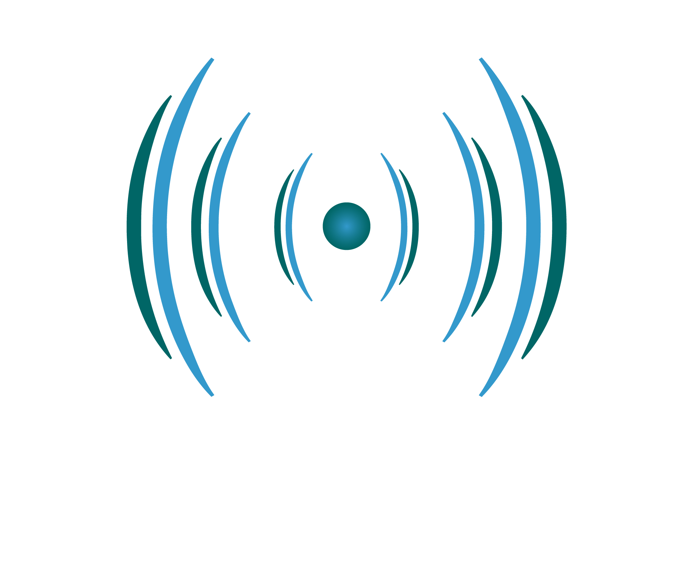

# Diseños y Logos • Universidad Austral de Chile

Este es un repositorio no oficial con logos recopilados de diversos departamentos de la Universidad Austral de Chile (UACh).

**Repositorio**: [https://github.com/aretesatori/Logos-UACh/](https://github.com/aretesatori/Logos-UACh/)

**Página web**: [https://aretesatori.github.io/Logos-UACh/](https://aretesatori.github.io/Logos-UACh/)

## Descripción

Actualmente, en la Universidad Austral de Chile no existe una plataforma o medio que facilite el acceso a los diseños de cada departamento existente. Cada facultad, instituto o escuela, de manera independiente, proporciona logos y gráficas a estudiantes, académicos, investigadores, entre otros. Sin embargo, en muchas de las veces los logos que se entregan no corresponden a las versiones originales o no están en buena resolución, ya que a menudo no se prioriza la calidad de los mismos.

Mi propuesta ante esta problemática es que los logos presentes en este repositorio estén disponibles para toda la comunidad, de manera que puedan ser utilizados según las necesidades académicas, ya sea en pósters, afiches, informes, proyectos de título, presentaciones de diapositivas, entre otros.

**El propósito de este repositorio es facilitar el acceso a logos y gráficas institucionales en excelente calidad a toda la comunidad universitaria**.

<!---
# Estructura

* La estructura de este repositorio se organiza en directorios, donde cada uno lleva el nombre de la unidad correspondiente y contiene los logos asociados.

**Ejemplo**:

```
├── Logos
    └── Facultad_Ciencias_Ingenieria
        ├── FCI-Blanco-Fondo-Transparente.png
        ├── FCI-Color-Fondo-Transparente-Oscuro.png
        ├── FCI-Cuadrado-Fondo-Pantone320C.png
        ├── FCI-Cuadrado-Fondo-PantoneOrange021C.png
        └── FCI-Negro-Fondo-Transparente.png
(...)
```

* Cada unidad tiene su propio directorio que incluye logos en las siguientes categorías:

	* Color
	* Blanco
	* Negro

* Además, se incluye información sobre cada color Pantone y RGB, la cual se encuentra dentro de cada directorio correspondiente.

* En cuanto a las dimensiones de los logos, existen tres variantes:

	* Logo pequeño: ancho de **512 px**.
	* Logo mediano: ancho de **1024 px**.
	* Logo grande: ancho de **2048 px**.

* Todos los logos están disponibles en formato PNG, SVG y EPS.

* Al final de este README se encuentra la fuente (links) de algunas gráficas originales obtenidas.
-->

---
## Importante

**Los derechos de autoría de cada logo corresponden a sus respectivos autores. Yo no soy el responsable por el diseño de los logos de cada departamento**.  

Se ha llevado a cabo la vectorización de algunos logos para mejorar su calidad. Además, se han realizado modificaciones gráficas en ciertos elementos, pero en todo momento preservando los diseños y colores originales.  
Los cambios y variantes existentes de cada logo en este repositorio no tienen como finalidad afectar la marca original, sino proporcionar alternativas que puedan adaptarse a los distintos contextos y necesidades de los miembros de la comunidad.  

**Solicito encarecidamente que todos utilicen estos logos de manera respetuosa y ética, reconociendo la propiedad intelectual de los respectivos autores y evitando cualquier uso que pueda perjudicar la imagen de los departamentos o de la propia Universidad Austral de Chile**.  

---
## Consideraciones

Cualquier contribución es muy bienvenida. Puede realizarla directamente a través de [GitHub](https://github.com/aretesatori/Logos-UACh/issues) o a mi correo electrónico: [arete.poffart@alumnos.uach.cl](mailto:arete.poffart@alumnos.uach.cl)

Se reciben solicitudes para realizar cambios, corrección o eliminación de los diseños presentes en este repositorio.

Espero que los logos que se presentan a continuación sean de aporte para la comunidad.

Cordialmente,

> **_Areté Satori Poffart de Oliveira_**  
> _Estudiante de Ing. Civil Electrónica_  
> _Universidad Austral de Chile_

---
# Índice

* [Universidad Austral de Chile](#universidad-austral-de-chile)

<!--* Admisión UACh

* Logo Aniversario

* Logo Acreditación-->

* [Facultad de Ciencias de la Ingeniería](#facultad-de-ciencias-de-la-ingeniería-fci)

	* [Pregrado](#pregrado)
		* [Ingeniería Civil Acústica](#1-ingeniería-civil-acústica)
		* [Ingeniería Civil en Construcción](#2-ingeniería-civil-en-construcción)
		* [Ingeniería Civil Electrónica](#3-ingeniería-civil-electrónica)
		* [Ingeniería Civil Industrial (sede Valdivia)](#4-ingeniería-civil-industrial)
		<!--* Ingeniería Civil Industrial (Puerto Montt)-->
		* [Ingeniería Civil en Informática](#5-ingeniería-civil-en-informática)
		* [Ingeniería Civil Mecánica](#6-ingeniería-civil-mecánica)
		* [Ingeniería Civil en Obras Civiles](#7-ingeniería-civil-en-obras-civiles)
		* [Ingeniería Naval](#8-ingeniería-naval)
		* [Ingeniería Plan Común (Bachillerato en Ciencias de la Ingeniería)](#9-ingeniería-plan-común-bachillerato-en-ciencias-de-la-ingeniería)

	* [Institutos](#institutos)
		* [Centro de Docencia de Ciencias Básicas para Ingeniería](#centro-de-docencia-de-ciencias-básicas-para-ingeniería)
		* Instituto de Acústica
		* Instituto de Ciencias Navales y Marítimas
		* Instituto de Obras Civiles
		* Instituto de Ingeniería Industrial y Sistemas
		* Instituto de Informática
		* Instituto de Ingeniería Mecánica
		* Instituto de Electricidad y Electrónica

<!--	
	* LeufüLab

	* CAF Miraflores
	* Audio Mining Laboratory (AuMiLab)
	* InnovING2030
	* Centro de Innovación 14K-->

<!--* Facultad de Ciencias
	* Instituto de Bioquímica y Microbiología
	* Instituto de Ciencias de la Tierra
	* Instituto de Ciencias Físicas y Matemáticas
	* Instituto de Ciencias Ambientales y Evolutivas
	* Instituto de Ciencias Químicas
	* Instituto de Farmacia
	* Instituto de Ciencias Marinas y Limnológicas

	* Geología

* Facultad de Filosofía y Humanidades

	* Instituto de Ciencias de la Educación
	* Instituto de Comunicación Social
	* Instituto de Estudios Antropológicos
	* Instituto de Linguistica y Literatura
	* Instituto de Historia y Ciencias Sociales
	* Instituto de Filosofía
	* Centro de Idiomas

	* Escuela de Graduados
	* Escuela de Historia y Ciencias Sociales
	* Coordinación Vinculación con el Medio

	* Magíster en Historia del Tiempo Presente

* Facultad de Ciencias Veterinarias
* Facultad de Ciencias Agrarias y Alimentarias

* Facultad de Medicina
* Facultad de Arquitectura y Artes

	* Arquitectura
	* Artes Musicales y Sonoras
	* Diseño

* Facultad de Ciencias Económicas y Administrativas
* Facultad de Ciencias Jurídicas y Sociales


* Jardín Botánico UACh
* Dirección de Infraestructura y Servicios
* Radio UACh
* CineClub UACh
* Unidad de Gestión Ambiental (UGA)
* Centro de Deportes y Recreación (CEDERE)
* Alumni UACh
* UACh Sustentable
* UCEA
* Patagón - Supercomputador UACh
* Preuniversitario UACh
* Orquesta Cámara de Valdivia
* Centro de Estudios Científicos (CECs)-->

---
# Gráficas

**Nota**: En este repositorio, los términos "Blanco" y "Negro" se utilizan para designar los colores correspondientes a los códigos hexadecimales **#FFF** y **#000**, respectivamente.

**Nota**: Todas las gráficas fueron creadas y editadas con **Adobe Illustrator CC**.

<!--**Nota**: Todas las imágenes presentes en este repositorio están guardadas en formato de color RGB, lo que significa que están desarrolladas para ser visualizadas en pantallas de dispositivos, pero no están optimizadas para impresión. **Si desea imprimir alguna de estas imágenes, se recomienda consultar a un diseñador gráfico especializado y principalmente asegurarse de trabajar con el formato de color CMYK antes de realizar cualquier tipo de impresión**.  -->

**Formato**: Los diseños están presentes en formato `PNG` (Portable Network Graphics) y `SVG` (Scalable Vector Graphics).

**Sugerencia**: Si es posible, utilice los logos en formato `SVG`, ya que no sufren pérdida de calidad. Muchas veces no son soportados en algunos editores como en Microsoft PowerPoint o Microsoft Word, en ese caso, utilice el logo en formato `PNG`.  
**Evite utilizar `JPG` para los diseños, ya que su uso implica la pérdida del fondo transparente y una considerable pérdida de calidad en ilustraciones de cualquier tipo**.  

## Universidad Austral de Chile

Página: [https://www.uach.cl/](https://www.uach.cl/)

### Colores

**Nota**: **Esta información acerca de los colores oficiales está sujeta a revisión**.

Los colores oficiales utilizados en el isotipo de la Universidad Austral de Chile son los que se muestran a continuación:

<p align="center">
	
	
	
	
</p>

> **Referencias**:  
> **Manual de Estilo Corporativo UACh**, actualización septiembre de 2023. (https://diario.uach.cl/wp-content/uploads/2023/09/MANUAL-CORPORATIVO-UACh-23.pdf)  
> Colore PANTONE® 200 C (https://www.numerosamente.it/pantone/200-C)  
> Colore PANTONE® 290 C (https://www.numerosamente.it/pantone/290-C)  
> Colore PANTONE® 349 C (https://www.numerosamente.it/pantone/349-C)  
> Colore PANTONE® 123 C (https://www.numerosamente.it/pantone/123-C)  

### Fuentes

La Universidad Austral de Chile utiliza en su logo fuentes de la familia **Garamond Condensed**.  

### Isotipo: Universidad Austral de Chile • Color

* <a href="https://raw.githubusercontent.com/aretesatori/Logos-UACh/main/Logos/UACh/SVG/Isotipo-UACh-Color.svg">**Descargar SVG**</a>

* <a href="https://raw.githubusercontent.com/aretesatori/Logos-UACh/main/Logos/UACh/PNG/Isotipo-UACh-Color_1024x1238.png">**Descargar PNG**</a> (1024 x 1238 px)  

<p align="center">
	
</p>

### Isotipo: Universidad Austral de Chile • Blanco

* <a href="https://raw.githubusercontent.com/aretesatori/Logos-UACh/main/Logos/UACh/SVG/Isotipo-UACh-Blanco.svg">**Descargar SVG**</a>

* <a href="https://raw.githubusercontent.com/aretesatori/Logos-UACh/main/Logos/UACh/PNG/Isotipo-UACh-Blanco_1024x1237.png">**Descargar PNG**</a> (1024 x 1237 px)  

<p align="center">
	
</p>

### Isotipo: Universidad Austral de Chile • Negro

* <a href="https://raw.githubusercontent.com/aretesatori/Logos-UACh/main/Logos/UACh/SVG/Isotipo-UACh-Negro.svg">**Descargar SVG**</a>

* <a href="https://raw.githubusercontent.com/aretesatori/Logos-UACh/main/Logos/UACh/PNG/Isotipo-UACh-Negro_1024x1237.png">**Descargar PNG**</a> (1024 x 1237 px)  

<p align="center">
	
</p>


## Facultad de Ciencias de la Ingeniería (FCI)

Página: [https://ingenieria.uach.cl/](https://ingenieria.uach.cl/)

### Colores

**Nota**: **Esta información acerca de los colores oficiales está sujeta a revisión**.

Los colores oficiales utilizados por la Facultad de Ciencias de la Ingeniería son los que se muestran a continuación:

<p align="center">
	
	
</p>

<!--<div align="center">
	<table>
		<thead>
			<tr>
				<th>Código Pantone®</th>
				<th>Código Hexadecimal</th>
				<th>Código RGB</th>
			</tr>
		</thead>
		<tbody>
			<tr>
				<td><strong>Orange 021 C</strong></td>
				<td><strong>#FE5000</strong></td>
				<td>rgb(254, 80, 0)</td>
			</tr>
			<tr>
				<td><strong>320 C</strong></td>
				<td><strong>#009CA6</strong></td>
				<td>rgb(0, 156, 166)</td>
			</tr>
		</tbody>
	</table>
</div>-->

> **Referencias**:  
> **Manual de Estilo Corporativo UACh**, actualización septiembre de 2023. (https://diario.uach.cl/wp-content/uploads/2023/09/MANUAL-CORPORATIVO-UACh-23.pdf)  
> Colore PANTONE® Orange 021 C (https://www.numerosamente.it/pantone/Orange-021-C)  
> Colore PANTONE® 320 C (https://www.numerosamente.it/pantone/320-C)  


### Fuentes

La Facultad de Ciencias de la Ingeniería utiliza en su logotipo la fuente **Myriad Pro Regular**.  

Los logotipos que contienen el texto "_UACh_" o "_Universidad Austral de Chile_" utilizan la fuente **Garamond Condensed Light Regular**.  


### Logo Oficial: Facultad de Ciencias de la Ingeniería • Color (Texto Negro)

* <a href="https://raw.githubusercontent.com/aretesatori/Logos-UACh/main/Logos/Facultad_Ciencias_Ingenieria/SVG/Logo-FCI-Oficial-Color-TextoNegro.svg">**Descargar SVG**</a>

* <a href="https://raw.githubusercontent.com/aretesatori/Logos-UACh/main/Logos/Facultad_Ciencias_Ingenieria/PNG/Logo-FCI-Oficial-Color-TextoNegro_2048x766.png">**Descargar PNG**</a> (2048 x 766 px)  

<p align="center">
	
</p>


### Logo Oficial: Facultad de Ciencias de la Ingeniería • Color (Texto Blanco)

* <a href="https://raw.githubusercontent.com/aretesatori/Logos-UACh/main/Logos/Facultad_Ciencias_Ingenieria/PNG/Logo-FCI-Oficial-Color-TextoBlanco.svg">**Descargar SVG**</a>

* <a href="https://raw.githubusercontent.com/aretesatori/Logos-UACh/main/Logos/Facultad_Ciencias_Ingenieria/PNG/Logo-FCI-Oficial-Color-TextoBlanco_2048x766.png">**Descargar PNG**</a> (2048 x 766 px)  

<p align="center">
	
</p>


### Logo Oficial: Facultad de Ciencias de la Ingeniería • Blanco

* <a href="https://raw.githubusercontent.com/aretesatori/Logos-UACh/main/Logos/Facultad_Ciencias_Ingenieria/SVG/Logo-FCI-Oficial-Blanco.svg">**Descargar SVG**</a>

* <a href="https://raw.githubusercontent.com/aretesatori/Logos-UACh/main/Logos/Facultad_Ciencias_Ingenieria/PNG/Logo-FCI-Oficial-Blanco_2048x766.png">**Descargar PNG**</a> (2048 x 766 px)  

<p align="center">
	
</p>


### Logo Oficial: Facultad de Ciencias de la Ingeniería • Negro

* <a href="https://raw.githubusercontent.com/aretesatori/Logos-UACh/main/Logos/Facultad_Ciencias_Ingenieria/SVG/Logo-FCI-Oficial-Negro.svg">**Descargar SVG**</a>

* <a href="https://raw.githubusercontent.com/aretesatori/Logos-UACh/main/Logos/Facultad_Ciencias_Ingenieria/PNG/Logo-FCI-Oficial-Negro_2048x766.png">**Descargar PNG**</a> (2048 x 766 px)  

<p align="center">
	
</p>


### Logo Oficial: Facultad de Ciencias de la Ingeniería • Pantone 320 C

* <a href="https://raw.githubusercontent.com/aretesatori/Logos-UACh/main/Logos/Facultad_Ciencias_Ingenieria/SVG/Logo-FCI-Oficial-Pantone320C.svg">**Descargar SVG**</a>

* <a href="https://raw.githubusercontent.com/aretesatori/Logos-UACh/main/Logos/Facultad_Ciencias_Ingenieria/PNG/Logo-FCI-Oficial-Pantone320C_2048x766.png">**Descargar PNG**</a> (2048 x 766 px)  

<p align="center">
	
</p>


### Logo Oficial: Facultad de Ciencias de la Ingeniería • Pantone Orange 021 C

* <a href="https://raw.githubusercontent.com/aretesatori/Logos-UACh/main/Logos/Facultad_Ciencias_Ingenieria/SVG/Logo-FCI-Oficial-PantoneOrange021C.svg">**Descargar SVG**</a>

* <a href="https://raw.githubusercontent.com/aretesatori/Logos-UACh/main/Logos/Facultad_Ciencias_Ingenieria/PNG/Logo-FCI-Oficial-PantoneOrange021C_2048x766.png">**Descargar PNG**</a> (2048 x 766 px)  

<p align="center">
	
</p>


### Logo Oficial Outline: Facultad de Ciencias de la Ingeniería • Blanco

* <a href="https://raw.githubusercontent.com/aretesatori/Logos-UACh/main/Logos/Facultad_Ciencias_Ingenieria/SVG/Logo-FCI-Oficial-Outline-Blanco.svg">**Descargar SVG**</a>

* <a href="https://raw.githubusercontent.com/aretesatori/Logos-UACh/main/Logos/Facultad_Ciencias_Ingenieria/PNG/Logo-FCI-Oficial-Outline-Blanco_2048x766.png">**Descargar PNG**</a> (2048 x 766 px)  

<p align="center">
	
</p>


### Logo Oficial Outline: Facultad de Ciencias de la Ingeniería • Negro

* <a href="https://raw.githubusercontent.com/aretesatori/Logos-UACh/main/Logos/Facultad_Ciencias_Ingenieria/SVG/Logo-FCI-Oficial-Outline-Negro.svg">**Descargar SVG**</a>

* <a href="https://raw.githubusercontent.com/aretesatori/Logos-UACh/main/Logos/Facultad_Ciencias_Ingenieria/PNG/Logo-FCI-Oficial-Outline-Negro_2048x766.png">**Descargar PNG**</a> (2048 x 766 px)  

<p align="center">
	
</p>


### Logo Oficial Outline: Facultad de Ciencias de la Ingeniería • Pantone 320 C

* <a href="https://raw.githubusercontent.com/aretesatori/Logos-UACh/main/Logos/Facultad_Ciencias_Ingenieria/SVG/Logo-FCI-Oficial-Outline-Pantone320C.svg">**Descargar SVG**</a>

* <a href="https://raw.githubusercontent.com/aretesatori/Logos-UACh/main/Logos/Facultad_Ciencias_Ingenieria/PNG/Logo-FCI-Oficial-Outline-Pantone320C_2048x766.png">**Descargar PNG**</a> (2048 x 766 px)  

<p align="center">
	
</p>


### Logo Oficial Outline: Facultad de Ciencias de la Ingeniería • Pantone Orange 021 C

* <a href="https://raw.githubusercontent.com/aretesatori/Logos-UACh/main/Logos/Facultad_Ciencias_Ingenieria/SVG/Logo-FCI-Oficial-Outline-PantoneOrange021C.svg">**Descargar SVG**</a>

* <a href="https://raw.githubusercontent.com/aretesatori/Logos-UACh/main/Logos/Facultad_Ciencias_Ingenieria/PNG/Logo-FCI-Oficial-Outline-PantoneOrange021C_2048x766.png">**Descargar PNG**</a> (2048 x 766 px)  

<p align="center">
	
</p>


### Logo Horizontal: Facultad de Ciencias de la Ingeniería • Color (Texto Negro)

* <a href="https://raw.githubusercontent.com/aretesatori/Logos-UACh/main/Logos/Facultad_Ciencias_Ingenieria/SVG/Logo-FCI-Horizontal-Color-TextoNegro.svg">**Descargar SVG**</a>

* <a href="https://raw.githubusercontent.com/aretesatori/Logos-UACh/main/Logos/Facultad_Ciencias_Ingenieria/PNG/Logo-FCI-Horizontal-Color-TextoNegro_2048x412.png">**Descargar PNG**</a> (2048 x 412 px)  

<p align="center">
	
</p>

### Logo Horizontal: Facultad de Ciencias de la Ingeniería • Color (Texto Blanco)

* <a href="https://raw.githubusercontent.com/aretesatori/Logos-UACh/main/Logos/Facultad_Ciencias_Ingenieria/SVG/Logo-FCI-Horizontal-Color-TextoBlanco.svg">**Descargar SVG**</a>

* <a href="https://raw.githubusercontent.com/aretesatori/Logos-UACh/main/Logos/Facultad_Ciencias_Ingenieria/PNG/Logo-FCI-Horizontal-Color-TextoBlanco_2048x412.png">**Descargar PNG**</a> (2048 x 412 px)  

<p align="center">
	
</p>


### Logo Horizontal: Facultad de Ciencias de la Ingeniería • Blanco

* <a href="https://raw.githubusercontent.com/aretesatori/Logos-UACh/main/Logos/Facultad_Ciencias_Ingenieria/SVG/Logo-FCI-Horizontal-Blanco.svg">**Descargar SVG**</a>

* <a href="https://raw.githubusercontent.com/aretesatori/Logos-UACh/main/Logos/Facultad_Ciencias_Ingenieria/PNG/Logo-FCI-Horizontal-Blanco_2048x412.png">**Descargar PNG**</a> (2048 x 412 px)  

<p align="center">
	
</p>


### Logo Horizontal: Facultad de Ciencias de la Ingeniería • Negro

* <a href="https://raw.githubusercontent.com/aretesatori/Logos-UACh/main/Logos/Facultad_Ciencias_Ingenieria/SVG/Logo-FCI-Horizontal-Negro.svg">**Descargar SVG**</a>

* <a href="https://raw.githubusercontent.com/aretesatori/Logos-UACh/main/Logos/Facultad_Ciencias_Ingenieria/PNG/Logo-FCI-Horizontal-Negro_2048x412.png">**Descargar PNG**</a> (2048 x 412 px)  

<p align="center">
	
</p>


### Logo Horizontal: Facultad de Ciencias de la Ingeniería • Pantone 320 C

* <a href="https://raw.githubusercontent.com/aretesatori/Logos-UACh/main/Logos/Facultad_Ciencias_Ingenieria/SVG/Logo-FCI-Horizontal-Pantone320C.svg">**Descargar SVG**</a>

* <a href="https://raw.githubusercontent.com/aretesatori/Logos-UACh/main/Logos/Facultad_Ciencias_Ingenieria/PNG/Logo-FCI-Horizontal-Pantone320C_2048x413.png">**Descargar PNG**</a>  (2048 x 413 px)  

<p align="center">
	
</p>


### Logo Horizontal: Facultad de Ciencias de la Ingeniería • Pantone Orange 021 C

* <a href="https://raw.githubusercontent.com/aretesatori/Logos-UACh/main/Logos/Facultad_Ciencias_Ingenieria/SVG/Logo-FCI-Horizontal-PantoneOrange021C.svg">**Descargar SVG**</a>

* <a href="https://raw.githubusercontent.com/aretesatori/Logos-UACh/main/Logos/Facultad_Ciencias_Ingenieria/PNG/Logo-FCI-Horizontal-PantoneOrange021C_2048x412.png">**Descargar PNG**</a> (2048 x 412 px)  

<p align="center">
	
</p>


### Logo Horizontal Outline: Facultad de Ciencias de la Ingeniería • Blanco

* <a href="https://raw.githubusercontent.com/aretesatori/Logos-UACh/main/Logos/Facultad_Ciencias_Ingenieria/SVG/Logo-FCI-Horizontal-Outline-Blanco.svg">**Descargar SVG**</a>

* <a href="https://raw.githubusercontent.com/aretesatori/Logos-UACh/main/Logos/Facultad_Ciencias_Ingenieria/PNG/Logo-FCI-Horizontal-Outline-Blanco_2048x412.png">**Descargar PNG**</a> (2048 x 412 px)  

<p align="center">
	
</p>


### Logo Horizontal Outline: Facultad de Ciencias de la Ingeniería • Negro

* <a href="https://raw.githubusercontent.com/aretesatori/Logos-UACh/main/Logos/Facultad_Ciencias_Ingenieria/SVG/Logo-FCI-Horizontal-Outline-Negro.svg">**Descargar SVG**</a>

* <a href="https://raw.githubusercontent.com/aretesatori/Logos-UACh/main/Logos/Facultad_Ciencias_Ingenieria/PNG/Logo-FCI-Horizontal-Outline-Negro_2048x412.png">**Descargar PNG**</a> (2048 x 412 px)  

<p align="center">
	
</p>


### Logo Horizontal Outline: Facultad de Ciencias de la Ingeniería • Pantone 320 C

* <a href="https://raw.githubusercontent.com/aretesatori/Logos-UACh/main/Logos/Facultad_Ciencias_Ingenieria/SVG/Logo-FCI-Horizontal-Outline-Pantone320C.svg">**Descargar SVG**</a>

* <a href="https://raw.githubusercontent.com/aretesatori/Logos-UACh/main/Logos/Facultad_Ciencias_Ingenieria/PNG/Logo-FCI-Horizontal-Outline-Pantone320C_2048x412.png">**Descargar PNG**</a> (2048 x 412 px)  

<p align="center">
	
</p>


### Logo Horizontal Outline: Facultad de Ciencias de la Ingeniería • Pantone Orange 021 C

* <a href="https://raw.githubusercontent.com/aretesatori/Logos-UACh/main/Logos/Facultad_Ciencias_Ingenieria/SVG/Logo-FCI-Horizontal-Outline-PantoneOrange021C.svg">**Descargar SVG**</a>

* <a href="https://raw.githubusercontent.com/aretesatori/Logos-UACh/main/Logos/Facultad_Ciencias_Ingenieria/PNG/Logo-FCI-Horizontal-Outline-PantoneOrange021C_2048x412.png">**Descargar PNG**</a> (2048 x 412 px)  

<p align="center">
	
</p>


### Isotipo: Facultad de Ciencias de la Ingeniería • Color

* <a href="https://raw.githubusercontent.com/aretesatori/Logos-UACh/main/Logos/Facultad_Ciencias_Ingenieria/SVG/Isotipo-FCI-Color.svg">**Descargar SVG**</a>

* <a href="https://raw.githubusercontent.com/aretesatori/Logos-UACh/main/Logos/Facultad_Ciencias_Ingenieria/PNG/Isotipo-FCI-Color_1024x856.png">**Descargar PNG**</a> (1024 x 856 px)  

<p align="center">
	
</p>

### Isotipo: Facultad de Ciencias de la Ingeniería • Blanco

* <a href="https://raw.githubusercontent.com/aretesatori/Logos-UACh/main/Logos/Facultad_Ciencias_Ingenieria/SVG/Isotipo-FCI-Blanco.svg">**Descargar SVG**</a>

* <a href="https://raw.githubusercontent.com/aretesatori/Logos-UACh/main/Logos/Facultad_Ciencias_Ingenieria/PNG/Isotipo-FCI-Blanco_1023x856.png">**Descargar PNG**</a> (1024 x 856 px)  

<p align="center">
	
</p>

### Isotipo: Facultad de Ciencias de la Ingeniería • Negro

* <a href="https://raw.githubusercontent.com/aretesatori/Logos-UACh/main/Logos/Facultad_Ciencias_Ingenieria/SVG/Isotipo-FCI-Negro.svg">**Descargar SVG**</a>

* <a href="https://raw.githubusercontent.com/aretesatori/Logos-UACh/main/Logos/Facultad_Ciencias_Ingenieria/PNG/Isotipo-FCI-Negro_1024x856.png">**Descargar PNG**</a> (1024 x 856 px)  

<p align="center">
	
</p>

### Isotipo Outline: Facultad de Ciencias de la Ingeniería • Color

* <a href="https://raw.githubusercontent.com/aretesatori/Logos-UACh/main/Logos/Facultad_Ciencias_Ingenieria/SVG/Isotipo-FCI-Outline-Color.svg">**Descargar SVG**</a>

* <a href="https://raw.githubusercontent.com/aretesatori/Logos-UACh/main/Logos/Facultad_Ciencias_Ingenieria/PNG/Isotipo-FCI-Outline-Color_1024x856.png">**Descargar PNG**</a> (1024 x 856 px)  

<p align="center">
	
</p>

### Isotipo Outline: Facultad de Ciencias de la Ingeniería • Blanco

* <a href="https://raw.githubusercontent.com/aretesatori/Logos-UACh/main/Logos/Facultad_Ciencias_Ingenieria/SVG/Isotipo-FCI-Outline-Blanco.svg">**Descargar SVG**</a>

* <a href="https://raw.githubusercontent.com/aretesatori/Logos-UACh/main/Logos/Facultad_Ciencias_Ingenieria/PNG/Isotipo-FCI-Outline-Blanco_1024x856.png">**Descargar PNG**</a> (1024 x 856 px)  

<p align="center">
	
</p>

### Isotipo Outline: Facultad de Ciencias de la Ingeniería • Negro

* <a href="https://raw.githubusercontent.com/aretesatori/Logos-UACh/main/Logos/Facultad_Ciencias_Ingenieria/SVG/Isotipo-FCI-Outline-Negro.svg">**Descargar SVG**</a>

* <a href="https://raw.githubusercontent.com/aretesatori/Logos-UACh/main/Logos/Facultad_Ciencias_Ingenieria/PNG/Isotipo-FCI-Outline-Negro_1024x856.png">**Descargar PNG**</a> (1024 x 856 px)  

<p align="center">
	
</p>

### Isotipo Outline: Facultad de Ciencias de la Ingeniería • Pantone 320 C

* <a href="https://raw.githubusercontent.com/aretesatori/Logos-UACh/main/Logos/Facultad_Ciencias_Ingenieria/SVG/Isotipo-FCI-Outline-Pantone320C.svg">**Descargar SVG**</a>

* <a href="https://raw.githubusercontent.com/aretesatori/Logos-UACh/main/Logos/Facultad_Ciencias_Ingenieria/PNG/Isotipo-FCI-Outline-Pantone320C_1024x856.png">**Descargar PNG**</a> (1024 x 856 px)  

<p align="center">
	
</p>

### Isotipo Outline: Facultad de Ciencias de la Ingeniería • Pantone Orange 021 C

* <a href="https://raw.githubusercontent.com/aretesatori/Logos-UACh/main/Logos/Facultad_Ciencias_Ingenieria/SVG/Isotipo-FCI-Outline-PantoneOrange021C.svg">**Descargar SVG**</a>

* <a href="https://raw.githubusercontent.com/aretesatori/Logos-UACh/main/Logos/Facultad_Ciencias_Ingenieria/PNG/Isotipo-FCI-Outline-PantoneOrange021C_1024x856.png">**Descargar PNG**</a> (1024 x 856 px)  

<p align="center">
	
</p>


### Isotipo Outline 2: Facultad de Ciencias de la Ingeniería • Color

* <a href="https://raw.githubusercontent.com/aretesatori/Logos-UACh/main/Logos/Facultad_Ciencias_Ingenieria/SVG/Isotipo-FCI-Outline2-Color.svg">**Descargar SVG**</a>

* <a href="https://raw.githubusercontent.com/aretesatori/Logos-UACh/main/Logos/Facultad_Ciencias_Ingenieria/PNG/Isotipo-FCI-Outline2-Color_1024x857.png">**Descargar PNG**</a> (1024 x 857 px)  

<p align="center">
	
</p>


### Isotipo Outline 2: Facultad de Ciencias de la Ingeniería • Blanco

* <a href="https://raw.githubusercontent.com/aretesatori/Logos-UACh/main/Logos/Facultad_Ciencias_Ingenieria/SVG/Isotipo-FCI-Outline2-Blanco.svg">**Descargar SVG**</a>

* <a href="https://raw.githubusercontent.com/aretesatori/Logos-UACh/main/Logos/Facultad_Ciencias_Ingenieria/PNG/Isotipo-FCI-Outline2-Blanco_1023x857.png">**Descargar PNG**</a> (1023 x 857 px)  

<p align="center">
	
</p>


### Isotipo Outline 2: Facultad de Ciencias de la Ingeniería • Negro

* <a href="https://raw.githubusercontent.com/aretesatori/Logos-UACh/main/Logos/Facultad_Ciencias_Ingenieria/SVG/Isotipo-FCI-Outline2-Negro.svg">**Descargar SVG**</a>

* <a href="https://raw.githubusercontent.com/aretesatori/Logos-UACh/main/Logos/Facultad_Ciencias_Ingenieria/PNG/Isotipo-FCI-Outline2-Negro_1024x857.png">**Descargar PNG**</a> (1024 x 857 px)  

<p align="center">
	
</p>


### Isotipo Outline 2: Facultad de Ciencias de la Ingeniería • Pantone 320 C

* <a href="https://raw.githubusercontent.com/aretesatori/Logos-UACh/main/Logos/Facultad_Ciencias_Ingenieria/SVG/Isotipo-FCI-Outline2-Pantone320C.svg">**Descargar SVG**</a>

* <a href="https://raw.githubusercontent.com/aretesatori/Logos-UACh/main/Logos/Facultad_Ciencias_Ingenieria/PNG/Isotipo-FCI-Outline2-Pantone320C_1024x857.png">**Descargar PNG**</a> (1024 x 857 px)  

<p align="center">
	
</p>


### Isotipo Outline 2: Facultad de Ciencias de la Ingeniería • Pantone Orange 021 C

* <a href="https://raw.githubusercontent.com/aretesatori/Logos-UACh/main/Logos/Facultad_Ciencias_Ingenieria/SVG/Isotipo-FCI-Outline2-PantoneOrange021C.svg">**Descargar SVG**</a>

* <a href="https://raw.githubusercontent.com/aretesatori/Logos-UACh/main/Logos/Facultad_Ciencias_Ingenieria/PNG/Isotipo-FCI-Outline2-PantoneOrange021C_1024x857.png">**Descargar PNG**</a> (1024 x 857 px)  

<p align="center">
	
</p>


### Logo: Facultad de Ciencias de la Ingeniería • Fondo Pantone 320 C

* <a href="https://raw.githubusercontent.com/aretesatori/Logos-UACh/main/Logos/Facultad_Ciencias_Ingenieria/SVG/Logo-FCI-FondoPantone320C.svg">**Descargar SVG**</a>

* <a href="https://raw.githubusercontent.com/aretesatori/Logos-UACh/main/Logos/Facultad_Ciencias_Ingenieria/PNG/Logo-FCI-FondoPantone320C_2048x2048.png">**Descargar PNG**</a> (2048 x 2048 px)  

<p align="center">
	
</p>


### Logo: Facultad de Ciencias de la Ingeniería • Fondo Pantone Orange 021 C

* <a href="https://raw.githubusercontent.com/aretesatori/Logos-UACh/main/Logos/Facultad_Ciencias_Ingenieria/SVG/Logo-FCI-FondoPantoneOrange021C.svg">**Descargar SVG**</a>

* <a href="https://raw.githubusercontent.com/aretesatori/Logos-UACh/main/Logos/Facultad_Ciencias_Ingenieria/PNG/Logo-FCI-FondoPantoneOrange021C_2048x2048.png">**Descargar PNG**</a> (2048 x 2048 px)  

<p align="center">
	
</p>


### Logo: Facultad de Ciencias de la Ingeniería • Fondo Negro

* <a href="https://raw.githubusercontent.com/aretesatori/Logos-UACh/main/Logos/Facultad_Ciencias_Ingenieria/SVG/Logo-FCI-FondoNegro.svg">**Descargar SVG**</a>

* <a href="https://raw.githubusercontent.com/aretesatori/Logos-UACh/main/Logos/Facultad_Ciencias_Ingenieria/PNG/Logo-FCI-FondoNegro_2048x2048.png">**Descargar PNG**</a> (2048 x 2048 px)  

<p align="center">
	
</p>


### Logo: Aniversario 90 Años Campus Miraflores • Color

* <a href="https://raw.githubusercontent.com/aretesatori/Logos-UACh/main/Logos/Facultad_Ciencias_Ingenieria/SVG/Logo-90A-Miraflores-Color.svg">**Descargar SVG**</a>

* <a href="https://raw.githubusercontent.com/aretesatori/Logos-UACh/main/Logos/Facultad_Ciencias_Ingenieria/PNG/Logo-90A-Miraflores-Color_2048x843.png">**Descargar PNG**</a> (2048 x 843 px)  

<p align="center">
	
</p>


### Logo: Aniversario 90 Años Campus Miraflores • Blanco

* <a href="https://raw.githubusercontent.com/aretesatori/Logos-UACh/main/Logos/Facultad_Ciencias_Ingenieria/SVG/Logo-90A-Miraflores-Blanco.svg">**Descargar SVG**</a>

* <a href="https://raw.githubusercontent.com/aretesatori/Logos-UACh/main/Logos/Facultad_Ciencias_Ingenieria/PNG/Logo-90A-Miraflores-Blanco_2048x843.png">**Descargar PNG**</a> (2048 x 843 px)  

<p align="center">
	
</p>


### Logo: Aniversario 90 Años Campus Miraflores • Negro

* <a href="https://raw.githubusercontent.com/aretesatori/Logos-UACh/main/Logos/Facultad_Ciencias_Ingenieria/SVG/Logo-90A-Miraflores-Negro.svg">**Descargar SVG**</a>

* <a href="https://raw.githubusercontent.com/aretesatori/Logos-UACh/main/Logos/Facultad_Ciencias_Ingenieria/PNG/Logo-90A-Miraflores-Negro_2048x843.png">**Descargar PNG**</a> (2048 x 843 px)  

<p align="center">
	
</p>


### Pregrado

#### 1. Ingeniería Civil Acústica

#### Logo Oficial: Ingeniería Civil Acústica • Color (Texto Blanco)

* <a href="https://raw.githubusercontent.com/aretesatori/Logos-UACh/main/Logos/Facultad_Ciencias_Ingenieria/SVG/Logo-Acustica-Oficial-Color-TextoBlanco.svg">**Descargar SVG**</a>

* <a href="https://raw.githubusercontent.com/aretesatori/Logos-UACh/main/Logos/Facultad_Ciencias_Ingenieria/PNG/Logo-Acustica-Oficial-Color-TextoBlanco_2048x1698.png">**Descargar PNG**</a> (2048 x 1698 px)  

<p align="center">
	
</p>

#### Logo Oficial: Ingeniería Civil Acústica • Color (Texto Negro)

* <a href="https://raw.githubusercontent.com/aretesatori/Logos-UACh/main/Logos/Facultad_Ciencias_Ingenieria/SVG/Logo-Acustica-Oficial-Color-TextoNegro.svg">**Descargar SVG**</a>

* <a href="https://raw.githubusercontent.com/aretesatori/Logos-UACh/main/Logos/Facultad_Ciencias_Ingenieria/PNG/Logo-Acustica-Oficial-Color-TextoNegro_2048x1698.png">**Descargar PNG**</a> (2048 x 1698 px)  

<p align="center">
	
</p>

#### Logo Oficial: Ingeniería Civil Acústica • Blanco

* <a href="https://raw.githubusercontent.com/aretesatori/Logos-UACh/main/Logos/Facultad_Ciencias_Ingenieria/SVG/Logo-Acustica-Oficial-Blanco.svg">**Descargar SVG**</a>

* <a href="https://raw.githubusercontent.com/aretesatori/Logos-UACh/main/Logos/Facultad_Ciencias_Ingenieria/PNG/Logo-Acustica-Oficial-Blanco_2048x1697.png">**Descargar PNG**</a> (2048 x 1697 px)  

<p align="center">
	
</p>

#### Logo Oficial: Ingeniería Civil Acústica • Negro

* <a href="https://raw.githubusercontent.com/aretesatori/Logos-UACh/main/Logos/Facultad_Ciencias_Ingenieria/SVG/Logo-Acustica-Oficial-Negro.svg">**Descargar SVG**</a>

* <a href="https://raw.githubusercontent.com/aretesatori/Logos-UACh/main/Logos/Facultad_Ciencias_Ingenieria/PNG/Logo-Acustica-Oficial-Negro_2048x1698.png">**Descargar PNG**</a> (2048 x 1698 px)  

<p align="center">
	
</p>

#### 2. Ingeniería Civil en Construcción

#### Logo Oficial: Ingeniería Civil en Construcción • Color

* <a href="https://raw.githubusercontent.com/aretesatori/Logos-UACh/main/Logos/Facultad_Ciencias_Ingenieria/SVG/Logo-IngCivilConstruccion-Oficial-Color.svg">**Descargar SVG**</a>

* <a href="https://raw.githubusercontent.com/aretesatori/Logos-UACh/main/Logos/Facultad_Ciencias_Ingenieria/PNG/Logo-IngCivilConstruccion-Oficial-Color_2048x2048.png">**Descargar PNG**</a> (2048 x 2048 px)  

<p align="center">
	
</p>

#### Logo Oficial: Ingeniería Civil en Construcción • Blanco

* <a href="https://raw.githubusercontent.com/aretesatori/Logos-UACh/main/Logos/Facultad_Ciencias_Ingenieria/SVG/Logo-IngCivilConstruccion-Oficial-Blanco.svg">**Descargar SVG**</a>

* <a href="https://raw.githubusercontent.com/aretesatori/Logos-UACh/main/Logos/Facultad_Ciencias_Ingenieria/PNG/Logo-IngCivilConstruccion-Oficial-Blanco_2048x2048.png">**Descargar PNG**</a> (2048 x 2048 px)  

<p align="center">
	
</p>

#### Logo Oficial: Ingeniería Civil en Construcción • Negro

* <a href="https://raw.githubusercontent.com/aretesatori/Logos-UACh/main/Logos/Facultad_Ciencias_Ingenieria/SVG/Logo-IngCivilConstruccion-Oficial-Negro.svg">**Descargar SVG**</a>

* <a href="https://raw.githubusercontent.com/aretesatori/Logos-UACh/main/Logos/Facultad_Ciencias_Ingenieria/PNG/Logo-IngCivilConstruccion-Oficial-Negro_2048x2048.png">**Descargar PNG**</a> (2048 x 2048 px)  

<p align="center">
	
</p>

#### 3. Ingeniería Civil Electrónica

#### Logo Oficial: Ingeniería Civil Electrónica • Color

* <a href="https://raw.githubusercontent.com/aretesatori/Logos-UACh/main/Logos/Facultad_Ciencias_Ingenieria/SVG/Logo-IngCivilElectronica-Oficial-Color.svg">**Descargar SVG**</a>

* <a href="https://raw.githubusercontent.com/aretesatori/Logos-UACh/main/Logos/Facultad_Ciencias_Ingenieria/PNG/Logo-IngCivilElectronica-Oficial-Color_2048x1409.png">**Descargar PNG**</a> (2048 x 1409 px)  

<p align="center">
	
</p>

#### Logo Oficial: Ingeniería Civil Electrónica • Blanco

* <a href="https://raw.githubusercontent.com/aretesatori/Logos-UACh/main/Logos/Facultad_Ciencias_Ingenieria/SVG/Logo-IngCivilElectronica-Oficial-Blanco.svg">**Descargar SVG**</a>

* <a href="https://raw.githubusercontent.com/aretesatori/Logos-UACh/main/Logos/Facultad_Ciencias_Ingenieria/PNG/Logo-IngCivilElectronica-Oficial-Blanco_2048x1409.png">**Descargar PNG**</a> (2048 x 1409 px)  

<p align="center">
	
</p>

#### Logo Oficial: Ingeniería Civil Electrónica • Negro

* <a href="https://raw.githubusercontent.com/aretesatori/Logos-UACh/main/Logos/Facultad_Ciencias_Ingenieria/SVG/Logo-IngCivilElectronica-Oficial-Negro.svg">**Descargar SVG**</a>

* <a href="https://raw.githubusercontent.com/aretesatori/Logos-UACh/main/Logos/Facultad_Ciencias_Ingenieria/PNG/Logo-IngCivilElectronica-Oficial-Negro_2048x1409.png">**Descargar PNG**</a> (2048 x 1409 px)  

<p align="center">
	
</p>

#### 4. Ingeniería Civil Industrial

#### Logo Oficial: Ingeniería Civil Industrial • Color

* <a href="https://raw.githubusercontent.com/aretesatori/Logos-UACh/main/Logos/Facultad_Ciencias_Ingenieria/SVG/Logo-IngCivilIndustrial-Oficial-Color.svg">**Descargar SVG**</a>

* <a href="https://raw.githubusercontent.com/aretesatori/Logos-UACh/main/Logos/Facultad_Ciencias_Ingenieria/PNG/Logo-IngCivilIndustrial-Oficial-Color_2048x895.png">**Descargar PNG**</a> (2048 x 895 px)  

<p align="center">
	
</p>

#### Logo Oficial: Ingeniería Civil Industrial • Blanco

* <a href="https://raw.githubusercontent.com/aretesatori/Logos-UACh/main/Logos/Facultad_Ciencias_Ingenieria/SVG/Logo-IngCivilIndustrial-Oficial-Blanco.svg">**Descargar SVG**</a>

* <a href="https://raw.githubusercontent.com/aretesatori/Logos-UACh/main/Logos/Facultad_Ciencias_Ingenieria/PNG/Logo-IngCivilIndustrial-Oficial-Blanco_2048x895.png">**Descargar PNG**</a> (2048 x 895 px)  

<p align="center">
	
</p>

#### Logo Oficial: Ingeniería Civil Industrial • Negro

* <a href="https://raw.githubusercontent.com/aretesatori/Logos-UACh/main/Logos/Facultad_Ciencias_Ingenieria/SVG/Logo-IngCivilIndustrial-Oficial-Negro.svg">**Descargar SVG**</a>

* <a href="https://raw.githubusercontent.com/aretesatori/Logos-UACh/main/Logos/Facultad_Ciencias_Ingenieria/PNG/Logo-IngCivilIndustrial-Oficial-Negro_2048x895.png">**Descargar PNG**</a> (2048 x 895 px)  

<p align="center">
	
</p>

#### 5. Ingeniería Civil en Informática

#### Logo Oficial: Ingeniería Civil en Informática • Color

* <a href="https://raw.githubusercontent.com/aretesatori/Logos-UACh/main/Logos/Facultad_Ciencias_Ingenieria/SVG/Logo-IngCivilInformatica-Oficial-Color.svg">**Descargar SVG**</a>

* <a href="https://raw.githubusercontent.com/aretesatori/Logos-UACh/main/Logos/Facultad_Ciencias_Ingenieria/PNG/Logo-IngCivilInformatica-Oficial-Color_2048x879.png">**Descargar PNG**</a> (2048 x 879 px)  

<p align="center">
	
</p>

#### Logo Oficial: Ingeniería Civil en Informática • Blanco

* <a href="https://raw.githubusercontent.com/aretesatori/Logos-UACh/main/Logos/Facultad_Ciencias_Ingenieria/SVG/Logo-IngCivilInformatica-Oficial-Blanco.svg">**Descargar SVG**</a>

* <a href="https://raw.githubusercontent.com/aretesatori/Logos-UACh/main/Logos/Facultad_Ciencias_Ingenieria/PNG/Logo-IngCivilInformatica-Oficial-Blanco_2048x879.png">**Descargar PNG**</a> (2048 x 879 px)  

<p align="center">
	
</p>

#### Logo Oficial: Ingeniería Civil en Informática • Negro

* <a href="https://raw.githubusercontent.com/aretesatori/Logos-UACh/main/Logos/Facultad_Ciencias_Ingenieria/SVG/Logo-IngCivilInformatica-Oficial-Negro.svg">**Descargar SVG**</a>

* <a href="https://raw.githubusercontent.com/aretesatori/Logos-UACh/main/Logos/Facultad_Ciencias_Ingenieria/PNG/Logo-IngCivilInformatica-Oficial-Negro_2048x879.png">**Descargar PNG**</a> (2048 x 879 px)  

<p align="center">
	
</p>

#### 6. Ingeniería Civil Mecánica

#### Logo Oficial: Ingeniería Civil Mecánica • Color

* <a href="https://raw.githubusercontent.com/aretesatori/Logos-UACh/main/Logos/Facultad_Ciencias_Ingenieria/SVG/Logo-IngCivilMecanica-Oficial-Color.svg">**Descargar SVG**</a>

* <a href="https://raw.githubusercontent.com/aretesatori/Logos-UACh/main/Logos/Facultad_Ciencias_Ingenieria/PNG/Logo-IngCivilMecanica-Oficial-Color_2048x2619.png">**Descargar PNG**</a> (2048 x 2619 px)  

<p align="center">
	
</p>

#### Logo Oficial: Ingeniería Civil Mecánica • Blanco

* <a href="https://raw.githubusercontent.com/aretesatori/Logos-UACh/main/Logos/Facultad_Ciencias_Ingenieria/SVG/Logo-IngCivilMecanica-Oficial-Blanco.svg">**Descargar SVG**</a>

* <a href="https://raw.githubusercontent.com/aretesatori/Logos-UACh/main/Logos/Facultad_Ciencias_Ingenieria/PNG/Logo-IngCivilMecanica-Oficial-Blanco_2048x2619.png">**Descargar PNG**</a> (2048 x 2619 px)  

<p align="center">
	
</p>

#### Logo Oficial: Ingeniería Civil Mecánica • Negro

* <a href="https://raw.githubusercontent.com/aretesatori/Logos-UACh/main/Logos/Facultad_Ciencias_Ingenieria/SVG/Logo-IngCivilMecanica-Oficial-Negro.svg">**Descargar SVG**</a>

* <a href="https://raw.githubusercontent.com/aretesatori/Logos-UACh/main/Logos/Facultad_Ciencias_Ingenieria/PNG/Logo-IngCivilMecanica-Oficial-Negro_2048x2619.png">**Descargar PNG**</a> (2048 x 2619 px)  

<p align="center">
	
</p>

#### 7. Ingeniería Civil en Obras Civiles

#### Logo Oficial: Ingeniería Civil en Obras Civiles • Color

* <a href="https://raw.githubusercontent.com/aretesatori/Logos-UACh/main/Logos/Facultad_Ciencias_Ingenieria/SVG/Logo-IngCivilObrasCiviles-Oficial-Color.svg">**Descargar SVG**</a>

* <a href="https://raw.githubusercontent.com/aretesatori/Logos-UACh/main/Logos/Facultad_Ciencias_Ingenieria/PNG/Logo-IngCivilObrasCiviles-Oficial-Color_2048x1947.png">**Descargar PNG**</a> (2048 x 1947 px)  

<p align="center">
	
</p>

#### Logo Oficial: Ingeniería Civil en Obras Civiles • Blanco

* <a href="https://raw.githubusercontent.com/aretesatori/Logos-UACh/main/Logos/Facultad_Ciencias_Ingenieria/SVG/Logo-IngCivilObrasCiviles-Oficial-Blanco.svg">**Descargar SVG**</a>

* <a href="https://raw.githubusercontent.com/aretesatori/Logos-UACh/main/Logos/Facultad_Ciencias_Ingenieria/PNG/Logo-IngCivilObrasCiviles-Oficial-Blanco_2048x1947.png">**Descargar PNG**</a> (2048 x 1947 px)  

<p align="center">
	
</p>

#### Logo Oficial: Ingeniería Civil en Obras Civiles • Negro

* <a href="https://raw.githubusercontent.com/aretesatori/Logos-UACh/main/Logos/Facultad_Ciencias_Ingenieria/SVG/Logo-IngCivilObrasCiviles-Oficial-Negro.svg">**Descargar SVG**</a>

* <a href="https://raw.githubusercontent.com/aretesatori/Logos-UACh/main/Logos/Facultad_Ciencias_Ingenieria/PNG/Logo-IngCivilObrasCiviles-Oficial-Negro_2048x1947.png">**Descargar PNG**</a> (2048 x 1947 px)  

<p align="center">
	
</p>

#### 8. Ingeniería Naval

#### Logo Oficial: Ingeniería Naval • Pantone 2758 C

* <a href="https://raw.githubusercontent.com/aretesatori/Logos-UACh/main/Logos/Facultad_Ciencias_Ingenieria/SVG/Logo-IngNaval-Oficial-Pantone2758C.svg">**Descargar SVG**</a>

* <a href="https://raw.githubusercontent.com/aretesatori/Logos-UACh/main/Logos/Facultad_Ciencias_Ingenieria/PNG/Logo-IngNaval-Oficial-Pantone2758C_2048x1188.png">**Descargar PNG**</a> (2048 x 1188 px)  

<p align="center">
	
</p>

#### Logo Oficial: Ingeniería Naval • Fondo Pantone 2758 C

* <a href="https://raw.githubusercontent.com/aretesatori/Logos-UACh/main/Logos/Facultad_Ciencias_Ingenieria/SVG/Logo-IngNaval-Oficial-FondoPantone2758C.svg">**Descargar SVG**</a>

* <a href="https://raw.githubusercontent.com/aretesatori/Logos-UACh/main/Logos/Facultad_Ciencias_Ingenieria/PNG/Logo-IngNaval-Oficial-FondoPantone2758C_2048x1188.png">**Descargar PNG**</a> (2048 x 1188 px)  

<p align="center">
	
</p>

#### Logo Oficial: Ingeniería Naval • Blanco

* <a href="https://raw.githubusercontent.com/aretesatori/Logos-UACh/main/Logos/Facultad_Ciencias_Ingenieria/SVG/Logo-IngNaval-Oficial-Blanco.svg">**Descargar SVG**</a>

* <a href="https://raw.githubusercontent.com/aretesatori/Logos-UACh/main/Logos/Facultad_Ciencias_Ingenieria/PNG/Logo-IngNaval-Oficial-Blanco_2048x1189.png">**Descargar PNG**</a> (2048 x 1189 px)  

<p align="center">
	
</p>

#### Logo Oficial: Ingeniería Naval • Negro

* <a href="https://raw.githubusercontent.com/aretesatori/Logos-UACh/main/Logos/Facultad_Ciencias_Ingenieria/SVG/Logo-IngNaval-Oficial-Negro.svg">**Descargar SVG**</a>

* <a href="https://raw.githubusercontent.com/aretesatori/Logos-UACh/main/Logos/Facultad_Ciencias_Ingenieria/PNG/Logo-IngNaval-Oficial-Negro_2048x1189.png">**Descargar PNG**</a> (2048 x 1189 px)  

<p align="center">
	
</p>

#### 9. Ingeniería Plan Común (Bachillerato en Ciencias de la Ingeniería)


### Institutos

#### Centro de Docencia de Ciencias Básicas para Ingeniería

* <a href="https://raw.githubusercontent.com/aretesatori/Logos-UACh/main/Logos/Facultad_Ciencias_Ingenieria/SVG/Logo-CentroDocenciaCienciasBasicasIngenieria-Oficial-Color.svg">**Descargar SVG**</a>

* <a href="https://raw.githubusercontent.com/aretesatori/Logos-UACh/main/Logos/Facultad_Ciencias_Ingenieria/PNG/Logo-CentroDocenciaCienciasBasicasIngenieria-Oficial-Color_2048x2051.png">**Descargar PNG**</a> (2048 x 2051 px)  

<p align="center">
	
</p>

<!--## Admisión UACh

## InnovING2030

Página: [https://ingenieria.uach.cl/innoving2030/](https://ingenieria.uach.cl/innoving2030/)-->

---
# Referencias

> Manual de Estilo Corporativo UACh, actualización septiembre de 2023 (https://diario.uach.cl/wp-content/uploads/2023/09/MANUAL-CORPORATIVO-UACh-23.pdf)  

> Gráfica Institucional, Rectoría (https://www.uach.cl/organizacion/rectoria/direccion-de-comunicaciones/grafica-institucional)

> Humanidades UACh (https://www.flickr.com/photos/194257994@N05/)

<!-- > Documentos (https://www.icml.uach.cl/documentos/) -->

> Ingeniería UACh (https://assets.adobe.com/public/9d9c75aa-8ed8-4789-7871-72501b6f35b5)

> Derecho UACh - Imagen Corporativa (https://derecho.uach.cl/index.php/vinculacion-con-el-medio/imagencorporativa.html)

<!-- Utilidades - Ingeniería Civil Industrial (https://icipm.uach.cl/utilidades/) -->

> Numerosamente.it (https://www.numerosamente.it/)